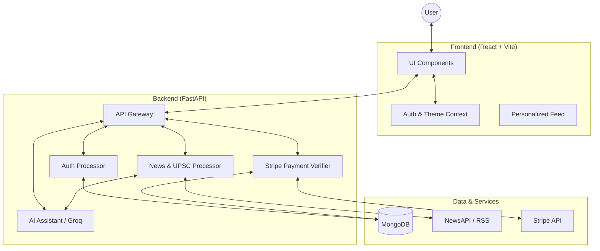
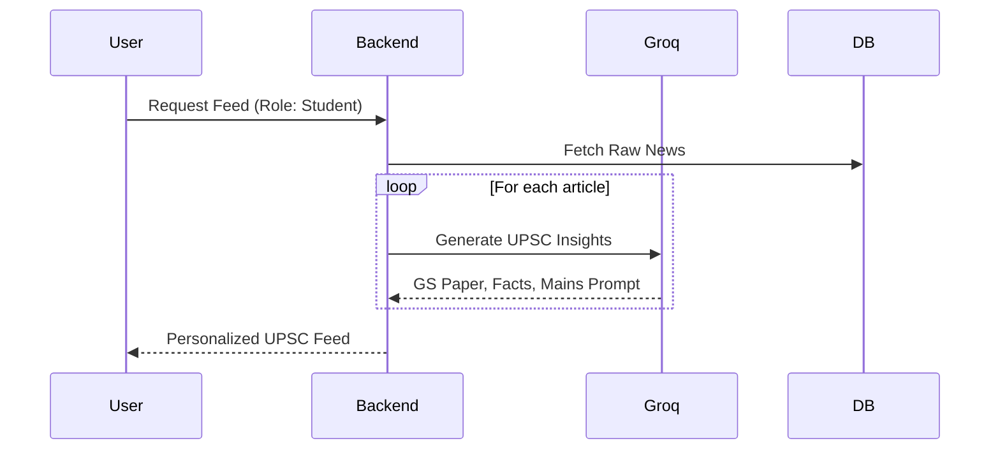
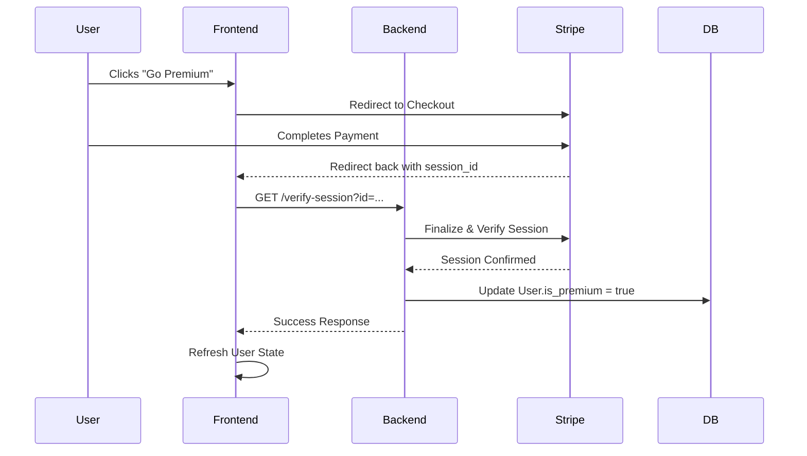

# crispy-octo-funicular


# 🐿️ Squirrel News: Personalized UPSC & Premium Hub

Squirrel News is a high-performance, AI-driven news aggregator and personalized learning companion. Designed for UPSC aspirants and news enthusiasts, it provides curated briefings, AI-powered enrichment, and an interactive squirrel companion (Squirrel) to help users master current affairs.

---

## 🏗️ Architecture



---

## 🔄 Workflows

### 1. UPSC Enrichment Flow


### 2. Premium Subscription Verification


---

## ✨ Features

- **Personalized Feed**: Content tailored to your role (Student, Professional, etc.).
- **UPSC Deep Prep**: Mapping news to GS Papers, Prelims facts, and Mains answers.
- **Interactive Squirrel**: Your AI companion for explaining news and taking quizzes.
- **Premium Perks**: Unlock advanced AI tools and UPSC-specific analytics via Stripe.
- **Dark Mode**: Sleek, eye-friendly design for late-night study sessions.

---

## 🚀 Getting Started

### Prerequisites
- Python 3.9+
- Node.js 18+
- MongoDB instance (local or Atlas)

### Local Setup

1. **Clone the repository**
   ```bash
   git clone https://github.com/levi178u/ET-Hackathon.git
   cd ET-Hackathon
   ```

2. **Environment Variables**
   Create `.env` in `backend/` and `frontend/`:
   ```env
   # Backend .env
   MONGODB_URL=your_mongo_url
   GROQ_API_KEY=your_groq_key
   STRIPE_SECRET_KEY=your_stripe_key
   NEWSAPI_KEY=your_newsapi_key
   ```

3. **Running the App**
   Use our automated deployment script:
   ```powershell
   ./scripts/deploy.ps1
   ```

---

## 🛠️ Tech Stack

- **Frontend**: React, Tailwind CSS 4, Lucide Icons, Axios.
- **Backend**: FastAPI, Motor (Async MongoDB), Pydantic.
- **AI**: Groq (Llama-3 models) for speed and intelligence.
- **Payment**: Stripe Checkout for seamless billing.
